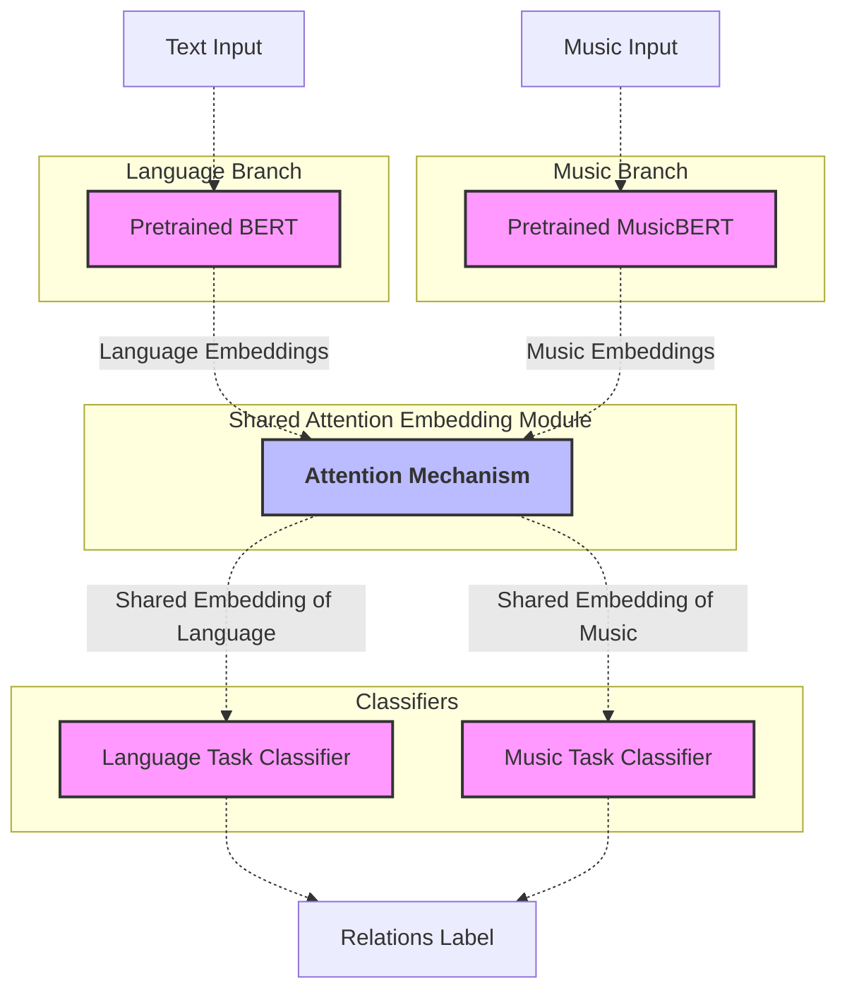

# Progress

13-way classification. **Allen’s Interval Algebra** 提供了 13 种常见的时间区间关系，例如 *before*、*meets*、*overlaps*、*starts*、*during*、*finishes*、*equals* 以及它们的对应逆关系 (after, met-by, overlapped-by, started-by, contained-by, finished-by)

- [ ] Data
  - [x] Music Octuples
  - [ ] English corpus?
  - [ ] Make dataset
    - [ ] Music
      - [ ] x: two sequences of music embeddings (simply concat, switch orders randomly as data augmentation)
      - [ ] y: time relation label
    - [ ] Speech
      - [ ] x: two sequences of speech embeddings
      - [ ] y: time relation label
- [ ] Model
  - [ ] Get Features
    - [x] Pretrained MusicBERT
    - [ ] Pretrained BERT
  - [ ] Shared Attention Embedding Module
  - [ ] Classifiers
- [ ] Train
- [ ] Analysis

